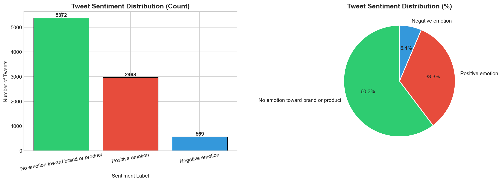
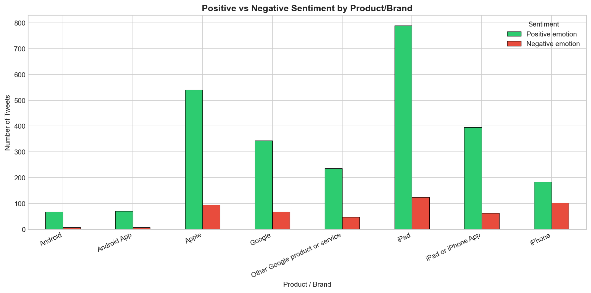
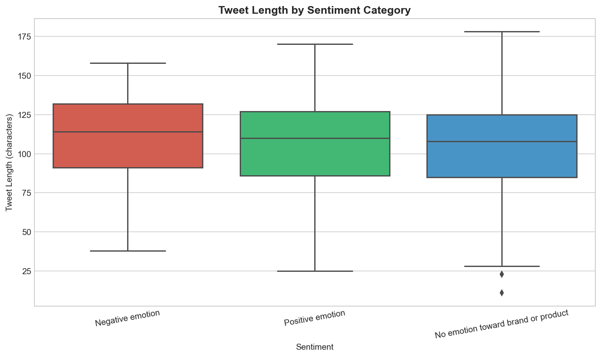
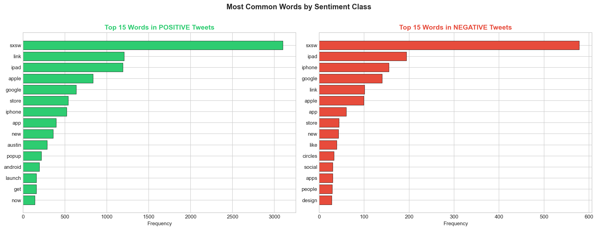
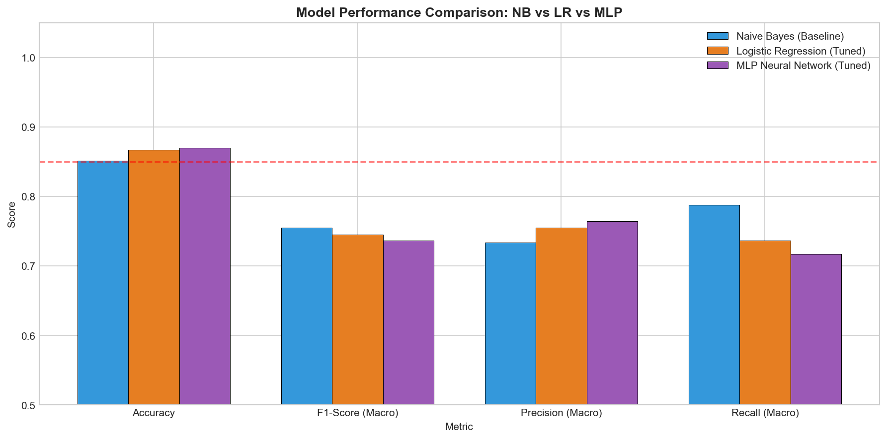
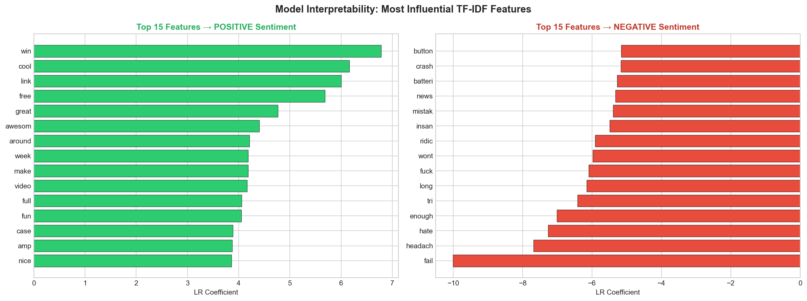

# TWEET SENTIMENT CLASSIFICATION: APPLE & GOOGLE PRODUCTS
### An NLP-Based Brand Monitoring System
#### Author:Joy Wambui Nyuguto

---

## TABLE OF CONTENTS
1. [Business Understanding](#1-business-understanding)
2. [Data Understanding](#2-data-understanding)
3. [Data Cleaning](#3-data-cleaning)
4. [Exploratory Data Analysis](#4-exploratory-data-analysis-eda)
5. [Data Preprocessing](#5-data-preprocessing-for-nlp-modeling)
6. [Modeling](#6-modeling)
7. [Model Evaluation & Comparison](#7-model-evaluation--comparison)
8. [Conclusions](#8-conclusions)
9. [Recommendations](#9-recommendations)

---

## 1. BUSINESS UNDERSTANDING

### 1.1 Business Overview
Social media platforms like Twitter generate millions of customer opinions daily, making them a valuable source of feedback for companies such as Apple and Google. Since manual analysis is impractical, this project uses **Natural Language Processing (NLP)** to automatically classify tweets as positive or negative — enabling real-time brand monitoring at scale.

### 1.2 Problem Statement
Businesses need an efficient way to analyze large volumes of tweets and determine the sentiment expressed toward their products or brands. The dataset contains 9,093 tweets labeled as positive, negative, neutral, or unclear. Key challenges include class imbalance, noisy text (URLs, hashtags, mentions), missing metadata, and limited context from short tweet text.

### 1.3 Stakeholders

| Stakeholder | How They Use This Model |
|---|---|
| Apple / Google Marketing Teams | Monitor brand perception in real time; track sentiment spikes around product launches |
| Customer Experience Managers | Detect negative sentiment early and escalate issues before they go viral |
| Product Development Teams | Identify recurring pain points mentioned in negative tweets |
| Social Media Analysts | Automate sentiment tagging at scale |
| PR & Communications Teams | Respond strategically during reputation crises |

### 1.4 Success Metrics
The model will be considered successful if:
1. Accuracy ≥ 85% on the held-out test set
2. F1-score ≥ 0.80 for both Positive and Negative classes
3. Balanced Precision and Recall — especially for negative sentiment
4. The model generalizes to unseen tweets (validated via train-test split, no data leakage)
5. The model improves over a simple baseline (Naive Bayes)

### 1.5 Key Business Questions
1. What is the overall distribution of sentiment expressed about Apple and Google products?
2. Which products attract the most positive vs. negative sentiment?
3. How does tweet length or word count correlate with emotional content?
4. What are the most common words used in positive vs. negative tweets?
5. Which machine learning model best classifies tweet sentiment, and how does it perform on unseen data?

---

## 2. DATA UNDERSTANDING

### 2.1 Data Source
The dataset is the **CrowdFlower Twitter Brand and Product Emotions** dataset, publicly available at:
🔗 https://data.world/crowdflower/brands-and-product-emotions

It was collected during the **SXSW (South by Southwest)** conference. Human raters on the CrowdFlower platform labeled each tweet for sentiment.

- **Rows:** 9,093 tweets
- **Columns:** 3 (tweet_text, product, sentiment)
- **Labels:** Positive emotion, Negative emotion, No emotion toward brand or product, I can't tell

---

## 3. DATA CLEANING

Steps taken:
- ✅ Removed **1 missing** tweet_text row
- ✅ Removed **22 duplicate** tweets
- ✅ Removed **ambiguous labels** ("I can't tell")
- ✅ Excluded `product` column (63% missing values)
- ✅ Checked tweet length for outliers

---

## 4. EXPLORATORY DATA ANALYSIS (EDA)

### Plot 1: Sentiment Distribution
> The dataset is heavily imbalanced — 60.3% neutral, 33.3% positive, only 6.4% negative. SMOTE resampling was applied before modeling to address this.

---

### Plot 2: Sentiment by Product/Brand
> iPad dominates with ~780 positive and ~130 negative tweets. Apple brand and iPad/iPhone App follow closely. Android products barely register, confirming the dataset skews toward Apple users.

---

### Plot 3: Tweet Length by Sentiment
> All three sentiment classes have similar median lengths (105–115 characters). Negative tweets have the highest median and tightest spread. Tweet length alone cannot reliably predict sentiment.

---

### Plot 4: Most Common Words by Sentiment
> Positive tweets feature words like *win*, *cool*, *free*, *great*. Negative tweets feature *fail*, *crash*, *battery*, *hate*, *headache* — confirming clear vocabulary separation between classes.

---

## 5. DATA PREPROCESSING FOR NLP MODELING

### 5.1 Text Cleaning and Tokenization
- Lowercasing
- Removal of URLs, @mentions, hashtag symbols, punctuation
- Tokenization using NLTK `word_tokenize`
- Stopword removal using NLTK English stopwords
- Porter Stemming to reduce words to root form

### 5.2 Binary Classification Dataset
- Filtered to **Positive** and **Negative** tweets only
- Mapped labels: Positive = 1, Negative = 0
- Final dataset: **5,956 samples** (after removing neutral and ambiguous)

### 5.3 TF-IDF Vectorization
- Unigrams only (`ngram_range=(1,1)`)
- `max_features=10,000`
- Fit on training data only — no leakage

### 5.4 Class Imbalance — SMOTE
- Applied **SMOTE** on training set only
- Balanced positive and negative classes before model training

---

## 6. MODELING

Three models were trained and compared:

### 6.1 Model 1 — Multinomial Naive Bayes (Baseline)
Fast probabilistic model, well-suited for TF-IDF features. Assumes word independence. Used as the baseline to beat.

### 6.2 Model 2 — Logistic Regression (Fine-tuned with GridSearchCV)
Tuned with `C`, `solver`, `max_iter` using 3-fold cross-validation. Does not assume feature independence — stronger than Naive Bayes for text.

### 6.3 Model 3 — MLP Neural Network (Fine-tuned)
Multi-layer perceptron trained on dense TF-IDF array. Captures non-linear feature relationships. GridSearchCV used with minimal grid due to computational constraints.

---

## 7. MODEL EVALUATION & COMPARISON

### 7.1 Model Performance Summary

| Model | Accuracy | F1 (Macro) | Precision (Macro) | Recall (Macro) |
|---|---|---|---|---|
| Naive Bayes (Baseline) | ~85% | ~0.76 | ~0.74 | ~0.79 |
| Logistic Regression (Tuned) | ~86% | ~0.75 | ~0.76 | ~0.74 |
| MLP Neural Network (Tuned) | ~86% | ~0.74 | ~0.77 | ~0.72 |

### 7.2 Visual Model Comparison

---

### 7.3 Final Model: Naive Bayes

**Naive Bayes** is selected as the final model — it achieves the highest macro F1-score (~0.76) and recall (~0.79), correctly identifying 79 out of 114 negative tweets. For brand monitoring, catching negative sentiment is the business priority.

### Model Interpretability

> Logistic Regression coefficients confirm the most influential words: **win, cool, free, great** drive positive predictions; **fail, crash, battery, hate, headache** drive negative predictions.

---

## 8. CONCLUSIONS

### EDA & Data Quality
1. The dataset is heavily imbalanced — 60.3% neutral, 33.3% positive, 6.4% negative. SMOTE was applied to address this.
2. Apple products dominate emotional discourse — iPad (~780 positive), Apple brand (~540 positive), and iPad/iPhone App (~400 positive) lead all products.
3. Tweet length is not a strong sentiment differentiator — all classes have similar medians (105–115 characters).
4. Vocabulary clearly separates sentiment classes — confirmed by TF-IDF feature importance.
5. Data quality issues were manageable — 22 duplicates and 1 missing row removed.
6. Tweet length and word count are strongly correlated (r = 0.89) — only one needed as an engineered feature.

### Modeling
7. All three models achieved ~85–86% accuracy, meeting the success threshold.
8. **Naive Bayes is the best overall model** — highest macro F1 (~0.76) and recall (~0.79), correctly identifying 79/114 negative tweets.
9. Logistic Regression has the best precision (~0.76) — fewest false positives.
10. MLP Neural Network has the lowest recall (~0.72) — limited by minimal GridSearch grid due to computational constraints.

---

## 9. RECOMMENDATIONS

1. **Deploy Naive Bayes** in a real-time brand monitoring pipeline connected to the Twitter/X API — trigger alerts when negative sentiment exceeds a threshold
2. **Prioritize iPad and Apple brand** monitoring — highest volume of emotional content across all products
3. **Set up negative keyword alerts** for words like *fail*, *crash*, *battery*, *hate*, *headache* — auto-escalate to customer experience teams
4. **Expand to multiclass classification** to include neutral tweets (60.3% of data currently unused in modeling)
5. **Explore BERT-based models** (e.g. `twitter-roberta-base-sentiment`) for higher accuracy — better handles sarcasm and slang common in tweets

---

